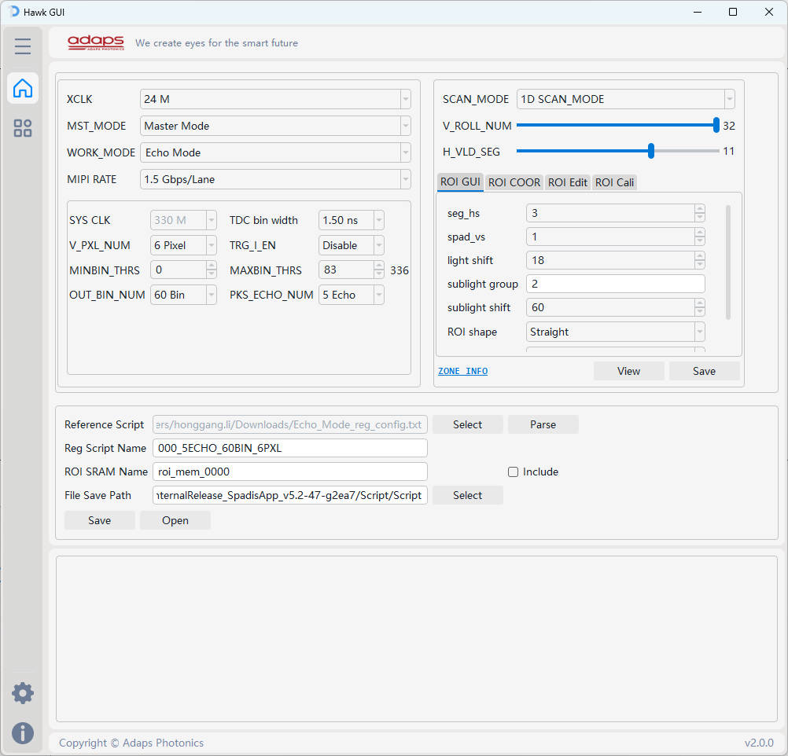
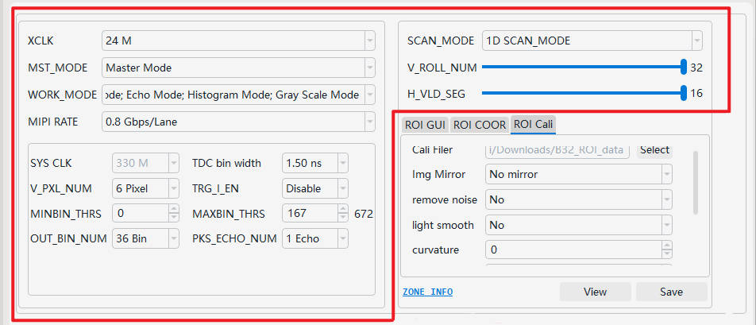
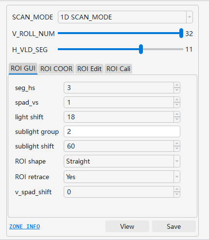
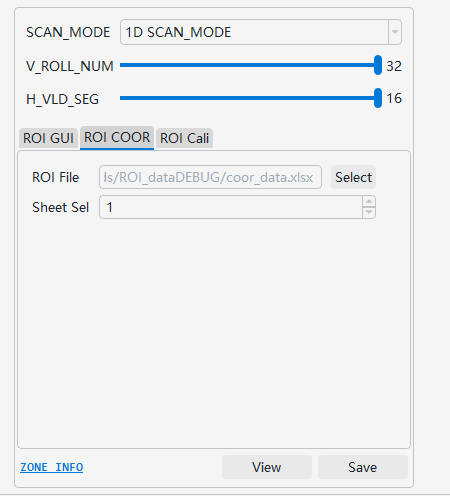
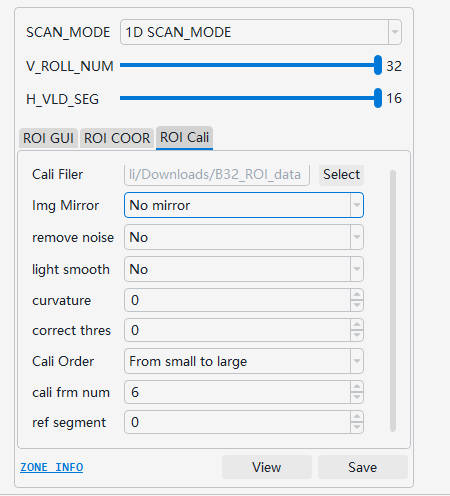
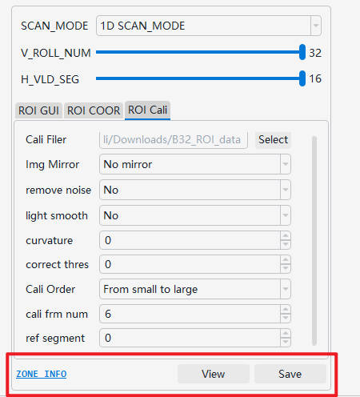
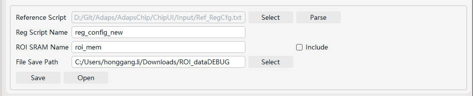
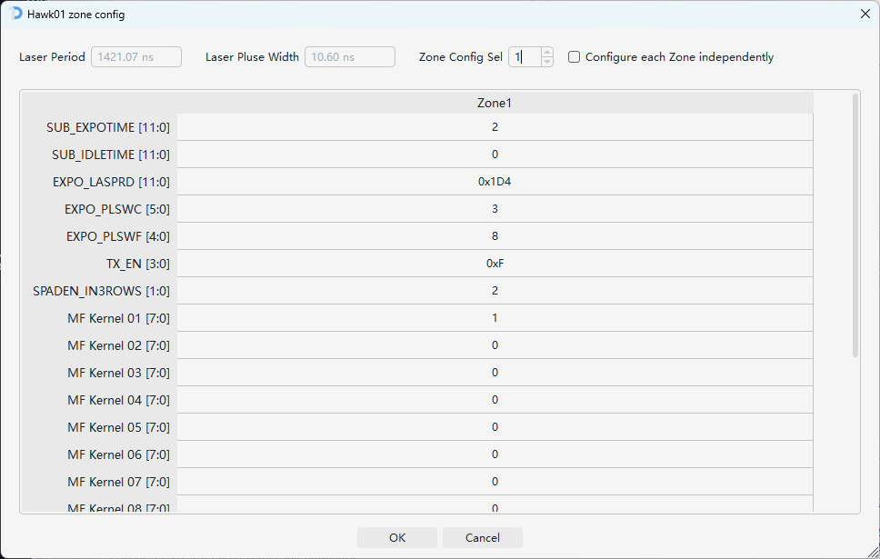
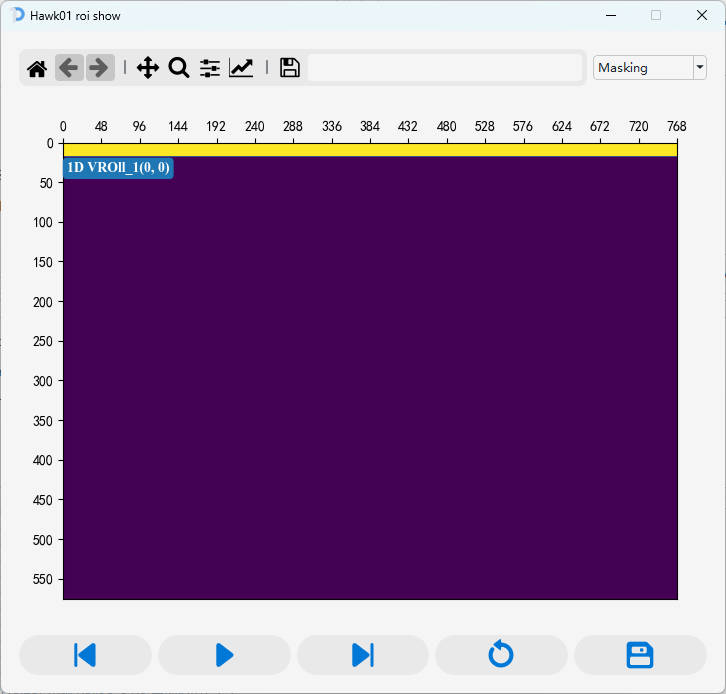
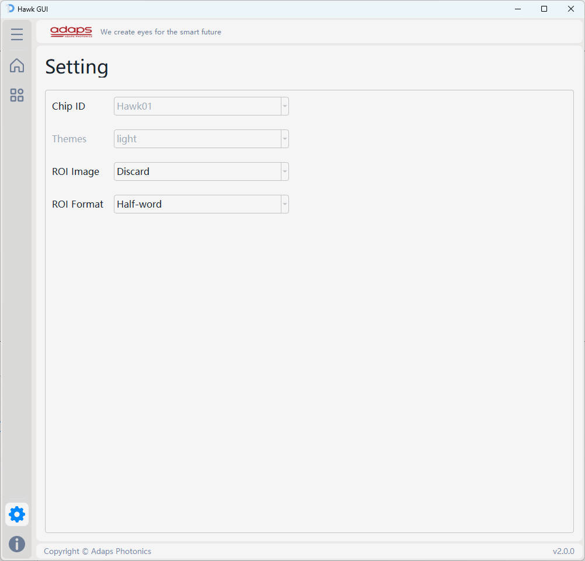

# 1. README
- [1. README](#1-readme)
- [2. 软件介绍](#2-软件介绍)
  - [2.1. 软件整体界面如下](#21-软件整体界面如下)
  - [2.2 配置界面](#22-配置界面)
    - [2.2.1 寄存器相关配置介绍](#221-寄存器相关配置介绍)
    - [2.2.2 ROI GEN:](#222-roi-gen)
      - [2.2.2.1 ROI GUI](#2221-roi-gui)
      - [2.2.2.2 ROI COOR](#2222-roi-coor)
      - [2.2.2.3 ~~ROI Edit~~](#2223-roi-edit)
      - [2.2.2.4 ROI Cali](#2224-roi-cali)
      - [2.2.2.5 ROI BUTTON](#2225-roi-button)
      - [2.2.3 脚本文件相关配置](#223-脚本文件相关配置)
  - [2.3 Zone Config界面](#23-zone-config界面)
  - [2.4 ROI Show界面](#24-roi-show界面)
- [2.5 软件设置界面](#25-软件设置界面)
- [3. 标定文件格式说明](#3-标定文件格式说明)
  - [3.1 txt 文件格式说明](#31-txt-文件格式说明)
  - [3.2 csv \& xls \& xlsx 文件格式说明](#32-csv--xls--xlsx-文件格式说明)
- [5. ROI配置校验](#5-roi配置校验)
- [6. 寄存器配置生成功能说明](#6-寄存器配置生成功能说明)

# 2. 软件介绍  
## 2.1. 软件整体界面如下  

## 2.2 配置界面 
### 2.2.1 寄存器相关配置介绍
> 程序会根据选择的配置, 基于基准脚本, 生成新的寄存器配置脚本. 寄存器配置脚本支持的功能请跳转 [***寄存器配置生成功能说明***](#6-寄存器配置生成功能说明) 进行查看
> 
1. XCLK: PLL_CLKIN 的输出参考时钟, 可配置为24M或25M
2. MST_MODE: 寄存器配置, 芯片是作为 Slave or Master 
3. WORK_MODE: 寄存器配置, 芯片工作模式选择, 可多选, 同时选择所有4种工作模式, 保存时则生成4种模式的系统配置脚本
4. MIPI RATE: MIPI 速率配置, 下拉选择, 0.8 / 1.0 / 1.2 / 1.5 Gbps/Lane
5. SYS_CLK: 系统时钟, TDC bin width配置后自动设置好系统时钟, 系统时钟支持: 200M、250M、330M
6. TDC bin width: 下拉选择, 0.75 / 1.00 / 1.25 / 1.50 / 2.00 / 2.50 ns
7. V_PXL_NUM: 寄存器配置, V_PXL_OUT_NUM
8. TRG_I_EN: 寄存器配置, TRG_I Enable or Disable, 根据硬件设计配置
9. MINBIN_TRHS: 寄存器配置, 修改配置时自动计算 BIN_NUMBER
10. MAXBIN_TRHS: 寄存器配置, 修改配置时自动计算 BIN_NUMBER
11. OUT_BIN_NUM: 寄存器配置
12. PKS_ECHO_NUM: 寄存器配置
13. SCAN_MODE: 寄存器配置, Rolling方式, 1D or 2D scan_mode
14. V_ROLL_NUM: 寄存器配置, 垂直方向Rolling次数, 选择范围: 1~32次
15. H_ROLL_NUM: 寄存器配置, 水平方向ROlling次数, 选择范围: 1~16次(仅 2D scan mode 配置)
16. H_VLD_SEG: 寄存器配置, 每次Rolling打开的段数, 1~16段
   
### 2.2.2 ROI GEN:
> ROI_GEN 主要用于生成 ROI 数据, 需要搭配 SCAN_MODE、V_ROLL_NUM、H_ROLL_NUM、H_VLD_SEG 配置生成 ROI 数据

#### 2.2.2.1 ROI GUI
> 根据界面上相关字段配置, 直接生成 ROI 数据  
> 
1. seg_hs: horizontal starting coordinates, 表示水平方向起始段数, 以segments为单位, 配置值1~16
2. spad_vs: vertical starting coordinates, 表示垂直方向起始坐标, 以spad为单位, 配置值范围: 1~576
3. light shift: 每次v_rolling, 当前光条相对于上一次v_roling光条的偏移spad个数
4. sublight shift: 每次rolling, 会打开6段子光条, 每段子光条与子光条之间偏移的spad个数
5. ROI shape: 光条的形状, 直线或者曲线, 此配置只为展示我们spad多样性, 实际使用以标定的roi为准; （此配置只在1D scan下生效）
6. ROI retrace: 光条纵坐标超过 576 之后, 是否需要绕回
7.  v_spad_shift:
   1. 1D scan: 子光条段与段之间在垂直方向上spad的偏移个数
   2. 2D scan: 每次h_rolling, 当前rolling的光条相对前一次rolling的光条在垂直方向上spad的偏移个数
8.  h_seg_shift: 此配置只在2D scan下生效, 表示每次h_rolling的起始位置相对与上次rolling的起始位置在水平方向上偏移的段数

#### 2.2.2.2 ROI COOR
> 根据给定的 ROI 坐标信息, 生成 ROI 数据  
> 
1. ROI File: ROI 坐标信息文件, 支持 *.txt, *.csv, *.xls, *.xlsx 格式, 程序自动识别文件类型进行解析. ROI COOR 标定文件格式请跳转 [***标定文件格式说明***](#4-标定文件格式说明) 进行查看
2. Sheet Sel: 当文件格式为 .xls or .xlsx 时, 支持指定 sheet 页, 生成 ROI 数据

#### 2.2.2.3 ~~ROI Edit~~
~~基于已经生成的 ROI Memory 文件, 解析 & 生成新的 ROI 数据~~

#### 2.2.2.4 ROI Cali  
> 该窗口是利用 SpadisApp 采集 Demo ROI 标定数据, 生成 ROI 脚本, 生成的 ROI 脚本用在 Fhr/Phr/Sphr模式  
> 
1. Cali File: 选择 ROI 标定数据的目录位置
2. Img Mirror: SpadisApp 采集标定数据时, 存在 X/Y Mirror, 对于标定数据, 需要进行如下处理:   
   <u>*建议在使用 SpadisApp 采集 ROI 标定数据时, 在Setting界面去除X/Y Mirror*</u>
   1. 若采集的数据在 SpadisApp 上未勾选 X/Y Mirror, 则此处选择No mirror
   2. 若采集的数据在 SpadisApp 上勾选了 X Mirror, 则此处选择 X-axis mirror
   3. 若采集的数据在 SpadisApp 上勾选了 Y Mirror, 则此处选择 Y-axis mirror
   4. 若采集的数据在 SpadisApp 上勾选了 X Mirror & Y Mirrorr, 则此处选择 X-axis and Y-axis mirror  
3. remove noise: 是否消除噪点, 如果光条明显, 噪点相对较弱时,  则配置为No
4. light smooth: 光条是否进行平滑处理, 建议设置为Yes
5. curvature: 相邻两段SPAD偏移范围, 超过偏移配置值, 强行矫正标定的 ROI
6. correct thres: ROI 矫正阈值(以 pixel 为单位, 0则不矫正)
7. cali Order: 处理 ROI 数据的顺序, 可选配置: 从小到大 or 从大到小---用户无需关注
8. cali frm num: 采集的标定数据有多帧时, 设置从灰度图中第几帧数据开始处理数据---用户无需关注
9. ref segment: 指定基于那一段segment用于偏移矫正(int), 默认0, 则以最亮段为基准---用户无需关注
10. mode 2D: 仅适用于2D scan模式, 0: 以光条能量优先；1: 以能 Masking的最大光子数优先

#### 2.2.2.5 ROI BUTTON
> 
1. `ZONE INFO`: 跳转到 ZONE CONFIG 界面, 进行 ROI Memory 其他相关配置. 具体使用说明请跳转 [***ZONE Config界面介绍***](#4-标定文件格式说明) 进行查看
2. `View`: 跳转到 ROI Show 界面, 展示当前窗口下配置的 ROI rolling 效果. ROI Show 界面介绍请跳转 [***ROI Show界面介绍***](#4-标定文件格式说明) 进行查看
3. `Save`: 保存当前窗口下配置的 ROI 脚本

#### 2.2.3 脚本文件相关配置 
> 
1. Reference Script: 基准脚本, 程序会根据选择的基准配置文件以及最新的配置信息, 自动生成新的寄存器配置脚本. 寄存器配置脚本支持的功能请跳转 [***寄存器配置生成功能说明***](#6-寄存器配置生成功能说明) 进行查看  
   `Parse`: 可以解析所选择脚本的寄存器配置, 同时会校验 MIPI WC & FLNR 配置是否正确
2. Reg Script Name: 保存的配置脚本名称
   - WORK_MODE 为单选时, 脚本名等于 `script_name.txt`
   - WORK_MODE 为多选时, 脚本名等于 `work_mode_config_name.txt`
3. ROI SRAM Name: 保存的 ROI 脚本名称: `roi_mem.txt`, 用户可自行修改  
   `Include`: 保存脚本时是否需要根据当前界面配置同步生成 `ROI Memory` 文件
4. File Save Path: 文件保存路径
5. `Save`: 保存 `寄存器配置脚本` 及 `ROI Memory` 数据
6. `Open`: 打开保存的文件夹 

## 2.3 Zone Config界面
> 此界面主要针对非 Masking 相关的 ROI Memory 配置
> 
1. Laser Period: 根据 Hawk GUI 工具 `主界面配置` 以及 `zone config` 界面配置自动计算出的激光重频时间, 无需手动配置
2. Laser Pluse Width: 根据 Hawk GUI 工具 `主界面配置` 以及 `zone config` 界面配置自动计算出的激光脉宽, 无需手动配置
3. Zone Config Sel: 仅在不勾选 `Configure each Zone independently` 时生效, 所有 Zone 都使用当前指定的 Zone 配置
4. Configure each Zone independently: 勾选时, 所有分区的配置都可以单独配置
5. Zone Config 界面支持 二进制 / 八进制 / 十进制 / 十六进制 方式输入, 格式分别为: `0b??(0b11)` / `0o??(0o55)` / `??(100)` / `0x??(0xFF)`
6. Zone Config 界面会对配置值范围进行校验, 配置须符合寄存器定义
   
## 2.4 ROI Show界面
> 此界面主要动态展示 Masking 效果
> 
1. 可以在左上角界面选择界面展示内容
   - 单次 rolling ROI 开启的区域(循环播放)
   - PCM 模式下, 所有 rolling 的效果
   - PTM 模式下, 所有 rolling 的效果

 2. Control Bar, 从左到右, 按钮功能依次为:
    >   
       - `预览上一帧`
       - `暂停 / 播放`
       - `预览下一帧`
       - `重播`
       - `保存`

# 2.5 软件设置界面
> 此界面主要为软件通用配置
> 
1. Chip ID: 目前仅支持 Hawk01
2. Themes: Not supported yet
3. ROI Image: ROI 数据保存时, 是否同步保存 ROI Masking 相关图片(图片内存偏大, 保存时速度较慢)
4. ROI Format: ROI 数据保存格式, Half-word or Byte

# 3. 标定文件格式说明
## 3.1 txt 文件格式说明
1. 每次Rolling需要指定一个坐标(所有 segment 纵坐标相同), Rolling与Rolling之间的坐标信息需换行配置, 不支持配置在同一行 
2. 坐标配置顺序需按照Rolling顺序依次配置, 如:
   1. 1D SCAN_MODE: V_ROLL_NUM=32 为例, 先配置第1次Rolling坐标, 再配置第2次、第3次...  
   > 
   2. 2D SCNA_MODE: V_ROLL_NUM=32, H_ROLL_NUM=4 为例:   
   > 
      1. 配置 vroll=1, hroll=1 简称`1-1` 的Rolling坐标  
      2. 配置 vroll=1, hroll=2 简称`1-2` 的Rolling坐标 
      3. 再依次配置`1-3、1-4、2-1、2-2...`     
3. 坐标配置格式: `x, y`分别为横坐标, 纵坐标。支持使用`英文/中文`的`逗号/分号` 分隔横纵坐标, 即(`,|;|, |；`), 禁止使用空格
4. 代码注释: 可使用双斜杠(`//`)在行尾添加注释或整行注释

## 3.2 csv & xls & xlsx 文件格式说明
1. csv & xls & xlsx 配置格式相同
> > 
2. 坐标配置顺序需按照Rolling顺序依次配置, 如:
   1. 1D SCAN_MODE: V_ROLL_NUM=32 为例, 先配置第1次Rolling坐标, 再配置第2次、第3次... 
   2. 2D SCNA_MODE: V_ROLL_NUM=32, H_ROLL_NUM=4 为例, 依次配置`1-1、1-2、1-3、1-4、2-1、2-2...`
2. 坐标配置格式: 在对应 segment 配置纵坐标, 纵坐标
3. 代码注释: 可使用双斜杠(`//`)在行尾添加注释或整行注释

# 5. ROI配置校验
主要包含以下校验: 
1. 标定文档格式校验
2. 标定文档数据正确性校验, 如: 坐标是否超过`(768, 576)`校验
3. 标定文档坐标信息条数校验, 坐标信息实际条数应为: 
   ~~~ python
   if SCAN_MODE == '1D SCAN_MODE': 
      num = V_ROLL_NUM
   else:
      num = V_ROLL_NUM * H_ROLL_NUM
   ~~~
   如: 配置`SCAN_MODE=1D SCAN_MODE, V_ROLL_NUM=15`, 则标定文档至少需要有15条坐标信息
   1. 若标定文档少于15条配置信息, 预览失败
   2. 若标定文档多于15条配置信息, 预览成功, 并提示: `标定文档可能与寄存器配置不匹配`

4. 坐标与配置信息综合合理性校验, 如: 标定信息为`(48, 0)`, 配置`SCAN_MODE=1D SCAN_MODE, H_VLD_SEG=15`时, 由于 `48 + H_VLD_SEG*48 > 768`, 会导致Rolling超边界, 预览失败

# 6. 寄存器配置生成功能说明
1. 系统时钟330、250、200M及分频相关寄存器配置
2. Upsampling 寄存器配置
3. MIPI 速率 0.8、1.0、1.2、1.5 Gbps/Lane 相关寄存器配置
4. MIPI_PKTDLY 自适应配置
5. ROI SRAM Block_write 配置
6. MIPI WC & FLNR配置
7. V_ROLL_NUM、H_ROLL_NUM、H_VLD_SEG、WOKR_MODE、SCAN_MODE等寄存器配置