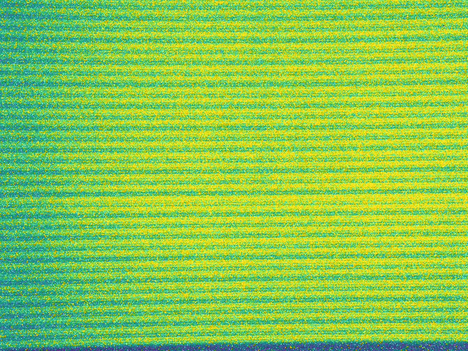
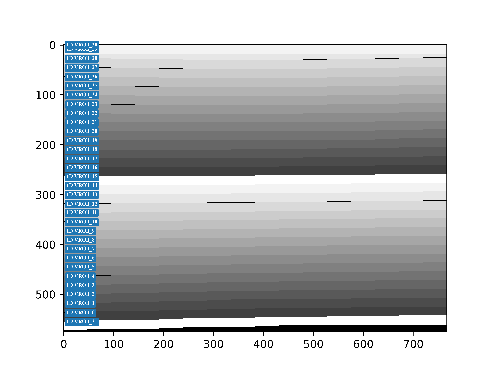

# 1. README
- [1. README](#1-readme)
- [2. 使用方法](#2-使用方法)
- [3. 文件说明](#3-文件说明)
  - [3.1. PubMethod.py](#31-pubmethodpy)
  - [3.2. ROIGenerate.py](#32-roigeneratepy)
  - [3.3. MskuCalibrationConfig.json](#33-mskucalibrationconfigjson)
  - [3.4. ROICalibration.py](#34-roicalibrationpy)
- [4. 详细说明](#4-详细说明)
  - [4.1. 标定功能概述](#41-标定功能概述)
- [5. 代码实现](#5-代码实现)
  - [5.1. PCM灰度图数据获取](#51-pcm灰度图数据获取)
  - [5.2. PCM噪点去除功能](#52-pcm噪点去除功能)
  - [5.3. 1D SCAN MODE标定实现逻辑](#53-1d-scan-mode标定实现逻辑)
  - [5.4. 2D SCAN MODE标定实现逻辑](#54-2d-scan-mode标定实现逻辑)
- [6. 生成文件说明](#6-生成文件说明)
  - [6.1. 单个文件标定效果图](#61-单个文件标定效果图)
  - [6.2. 所有文件的光条融和图](#62-所有文件的光条融和图)
  - [6.3. 所有文件标定效果图的融合](#63-所有文件标定效果图的融合)
  - [6.4. Masking效果图](#64-masking效果图)
  - [6.5. ROI Data](#65-roi-data)
- [7. 其他](#7-其他)


# 2. 使用方法
1. 编辑MskuCalibrationConfig.json配置文件，配置相关信息: 
   1. `fd_path`: PCM灰度图.raw格式文件路径，数据获取方式&修改，请查看[**pcm灰度图数据获取**](#51-pcm灰度图数据获取)
   2. `file_path`: 生成的数据存储路径
   3. `roi_name`: 生成的ROI文件名
   4. 寄存器相关配置: SCAN_MODE、V_ROLL_NUM、H_ROLL_NUM、H_VLD_SEG、zone_cfg_def
   5. 标定方式相关配置: is_reverse、remove_noise、curvature、mode2D等（使用方法请参考配置文件相关注释）
2. 配置文件编辑完成后，执行ROICalibration.py文件进行标定  
*ps: Python第三方依赖包: numpy、matplotlib等*

# 3. 文件说明

## 3.1. PubMethod.py
> 提供一些通用方法

## 3.2. ROIGenerate.py
> 提供ROI生成相关方法

## 3.3. MskuCalibrationConfig.json
> 标定配置文件

## 3.4. ROICalibration.py
> 标定程序主文件，主要包含标定功能，ROI Data生成

# 4. 详细说明
## 4.1. 标定功能概述
- 文件标定顺序支持正序或倒叙(ROI按照文件标定顺序生成ROI)
- 支持噪点消除功能，标定PCM图像质量较差时，建议开启
- 关于1D SCAN_MODE: 
  - 支持任意H_VLD_SEG配置扫描
  - 支持标定矫正，相邻两段标定的ROI超过偏移配置值，可进行ROI标定矫正
- 关于2D SCAN_MODE: 
  - 支持任意H_VLD_SEG配置扫描
  - 支持两种标定方式: 1) 按照光中心区域标定；2) 按照可获取最大光子数进行标定
- 支持将单次标定的ROI与光条融合为一张图，成图Check标定是否正确
- 支持将所有标定的ROI与光条融合为一张图，成图Check标定是否正确
- 支持ROI文件生成起始ROLL定义，支持类Lumotive使用SSYNC控制激光发射场景
- 支持将生成的ROI标定文件成图，Check ROI文件生成是否正确
- 支持32 Zone分区曝光时间、重频周期、Kernel等config配置不同
-  使用方法请查阅: MskuCalibrationConfig.json相关注释


# 5. 代码实现

## 5.1. PCM灰度图数据获取
1. Lumotive 获取 .raw 标定文件的代码实现
> ```python
> def get_pcm_file(fp: str) -> dict: ...
> 
> file_dict = get_pcm_file(cfg['fd_path'])
> ```

2. 用户自定义获取文件的数据格式要求
   - 要求数据格式为dict格式，key最好是数字 or 字母，便于文件读取时排序
   - 将获取的文件替换Lumotive文件获取 .raw 的代码即可
> ~~~python
> """{key: value}, key为文件索引，value为文件路径"""
> f_dict = {  0:"./roll0.raw",
>             1:"./roll1.raw",
>             2:"./roll2.raw"
>         }
> # 标定顺序根据 key 进行排序标定，可正序 或 倒序
> ~~~

1. 文件校验
   - 增加PCM灰度图数据校验，文件数据应该与总的rolling次数保持一致
> ~~~python
> roll_num = (v_roll_num + 1) if scan_mode == 0 else (h_roll_num + 1) * (v_roll_num + 1)
> if len(file_dict) != roll_num:
>     raise ValueError("...")
> ~~~

## 5.2. PCM噪点去除功能
1. ROI标定通过`Conv2()`实现了3*3卷积，去除PCM灰度图噪点，提高ROI标定正确率(可选)

## 5.3. 1D SCAN MODE标定实现逻辑
1. 将 SPAD 按照 576\*48 划分(共16段)，然后累和，获得 576\*16 矩阵`seg_sum_array`（按段累和后再标定，可以极大降部噪点导致标定误差的概率）
2. 对`seg_sum_array`按列找到最大值`v_spad_value` & 最大位置索引`v_spad_max_index`（最大值视作光最强，索引视作段光条中心点）【1\*16的矩阵】
3. 根据`H_VLD_SEG`配置对`v_spad_value`进行开窗，在16段中获取光条最亮的段
4. 对于获取的段，对`v_spad_max_index`进行开窗，获取每段光条的位置（开窗大小为18，固定开启18行spad）
5. 以最亮的段为基准，对其他标定的段，增加矫正功能: 相邻两段标定的SPAD超过偏移配置值，强行矫正标定的ROI

## 5.4. 2D SCAN MODE标定实现逻辑
1. 步径为1，从第0段开始，将 SPAD 按照`576*48*(H_VLD_SEG+1)` 进行累和，获得 576*16 矩阵`seg_sum_array`（累和后标定，可以极大降低局部噪点导致标定误差的概率）
2. 对`seg_sum_array`按列找到最大值`v_spad_value` & 最大位置索引`v_spad_max_index`（最大值视作光最强，索引视作应段光条中心点）【1\*16的矩阵】
3. mode_2D=0: 按照光中心区域标定，查找`v_spad_value`最大值所在索引，获取光条开启的段
4. mode_2D=1: 按照可获取最大光子数进行标定，对`v_spad_max_index`进行开窗，通过比较光子数，获取光条开启的段
5. 对于获取的段，对`v_spad_max_index`进行开窗，获取光条开启的位置（开窗大小为18，固定开启18行spad）

# 6. 生成文件说明
## 6.1. 单个文件标定效果图
1. 文件名: Roll{0}_{1}.png，其中`{0}`为rolling计数，`{1}`为文件的key  


## 6.2. 所有文件的光条融和图
1. 文件名:  fusion_imag.png  


## 6.3. 所有文件标定效果图的融合
1. 文件名:  fusion_msku.png  


## 6.4. Masking效果图
1. 文件名: msku_imag.png，生成ROI文件的Masking效果图  


## 6.5. ROI Data
1. ROI SRAM数据 .txt文件


# 7. 其他
- ROI标定仅支持每次连续开启18行SPAD，即1个大光条6个子光条紧挨的标定方式
- ROI标定每次固定开启18行SPAD，未支持光条在垂直方向超边界场景
- 2D Scan mode，ROI标定固定开启指定H_VLD_SEG段数，未支持光条水平方向超边界场景
- Python第三方依赖包: numpy、matplotlib等