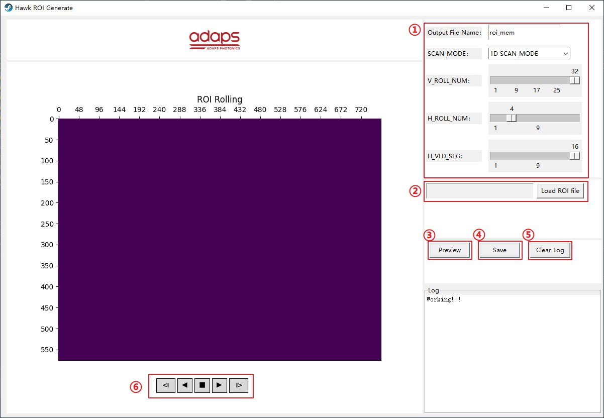
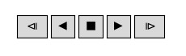
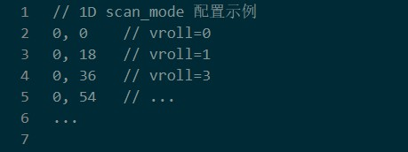
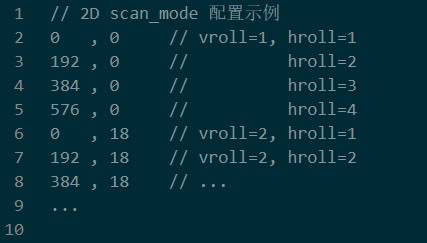

# 1. README
- [1. README](#1-readme)
- [2. 软件介绍](#2-软件介绍)
- [3. 使用方法](#3-使用方法)
- [4. 标定文件格式说明](#4-标定文件格式说明)
- [5. 配置校验](#5-配置校验)
- [6. 其他](#6-其他)

# 2. 软件介绍
1. 软件界面如下  

2. 元素①: 
   1. OutPut File Name: 文件保存时的文件名称
   2. SCAN_MODE: 下拉选择，1D SCAN_MODE、2D SCAN_MODE
   3. V_ROLL_NUM: 垂直方向Rolling次数，选择范围: 1~32次
   4. H_ROLL_NUM: 水平方向ROlling次数，选择范围: 1~16次
   5. H_VLD_SEG: 每次Rolling打开的段数, 1~16段
3. 元素②：
   1. 标定文件选择窗口, 默认打开./Input文件夹
   2. 标定文件格式请参看[**标定文件格式说明**](#4-标定文件格式说明)
4. 元素③、④、⑤分别为预览、保存、日志清除按钮
5. 元素⑥：   
   
   1. 从左到右，按钮功能依次为：
      - `预览上一帧`
      - `向后连续预览`
      - `停止预览`
      - `向前连续预览`
      - `预览下一帧`

# 3. 使用方法
1. 根据需求在界面上进行相应的配置
2. 将标定文件保存在`./Input`文件夹下
3. Load标定文件, 标定文件格式请参看[**标定文件格式说明**](#4-标定文件格式说明)
4. 点击预览, 查看Rolling效果
5. 点击保存, 程序将生成相关ROI文件, 文件保存在`./Output`路径下  
6. 输出文件说明: `*.png`为整体Rolling效果展示图; `*.txt`为Hawk ROI标定信息文件  
*ps: 点击保存时，保存的ROI文件为左侧预览窗口的Rolling信息。因此, 修改相关配置或重新加载标定文件后, 请先点击预览, 再点击保存*

# 4. 标定文件格式说明
1. 标定信息仅支持`*.txt`文件格式
2. 每次Rolling需要指定一个坐标, Rolling与Rolling之间的坐标信息需换行配置, 不支持配置在同一行 
3. 坐标配置顺序需按照Rolling顺序依次配置, 如:
   1. 1D SCAN_MODE: V_ROLL_NUM=32 为例，先配置第1次Rolling坐标, 再配置第2次、第3次...  
      
   2. 2D SCNA_MODE: V_ROLL_NUM=32, H_ROLL_NUM=4 为例:  
      1. 配置 vroll=1, hroll=1 简称`1-1` 的Rolling坐标  
      2. 配置 vroll=1, hroll=2 简称`1-2` 的Rolling坐标 
      3. 再依次配置`1-3、1-4、2-1、2-2...`  
      
      
4. 坐标配置格式：`x, y`分别为横坐标，纵坐标。支持使用`英文/中文`的`逗号/分号` 分隔横纵坐标, 即(`,|;|，|；`), 禁止使用空格
5. 代码注释：可使用双斜杠(`//`)在行尾添加注释或整行注释

# 5. 配置校验
主要包含以下校验：
1. 标定文档格式校验
2. 标定文档数据正确性校验, 如: 坐标是否超过`(768, 576)`校验
3. 标定文档坐标信息条数校验, 坐标信息实际条数应为: 
   ~~~ python
   if SCAN_MODE == '1D SCAN_MODE': 
      num = V_ROLL_NUM
   else:
      num = V_ROLL_NUM * H_ROLL_NUM
   ~~~
   如: 配置`SCAN_MODE=1D SCAN_MODE, V_ROLL_NUM=15`, 则标定文档至少需要有15条坐标信息
   1. 若标定文档少于15条配置信息, 预览失败
   2. 若标定文档多于15条配置信息，预览成功, 并提示: `标定文档可能与寄存器配置不匹配`

4. 坐标与配置信息综合合理性校验, 如: 标定信息为`(48, 0)`, 配置`SCAN_MODE=1D SCAN_MODE, H_VLD_SEG=15`时, 由于 `48 + H_VLD_SEG*48 > 768`, 会导致Rolling超边界, 预览失败

# 6. 其他
- Nothing